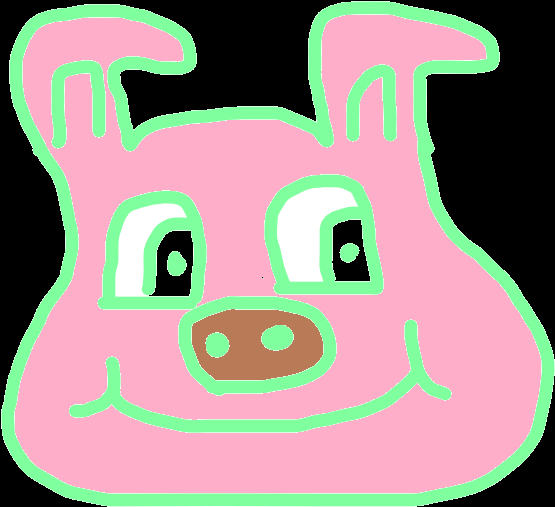

# Pig

## Mechanics
You start a new game by clicking the Play button. You will be presented with two options (In the case you go first) {Roll, Hold}.
Roll will roll the die and add the obtained points to the pending area.
Hold will reap the points from the pending area and add them to your score, passing the turn to the digital computer.
There is a condition you will need to have in mind when deciding which way to go. Pig Out!!! Which means you only add one point to your score and lose all the pending points you have up until this point. Again, this causes the digital computer to take its chance and perform a decision too.
Either you or the digital computer will win when either of you reach the goal, at this point of time is fixed to fifty points. Best of luck!

## History
While I am a Software Developer, I also consider myself most of the time a lifelong learner. I was following the training course [Design of Computer Programs](https://www.udacity.com/course/design-of-computer-programs--cs212) taught by [Peter Norvig](https://en.wikipedia.org/wiki/Peter_Norvig) and felt very enthusiastic when this game was presented in unit 5, so I decided to actually implement it as a web application using only web standards. In a quick search I realized this is actually a very [stablished game](https://en.wikipedia.org/wiki/Pig_(dice_game)) I did not happen to know.

## This implementation
This implementation is not designed to always win, you will notice certain decisions taken by the digital computer as not being optimal.
Perhaps some behavior will feel odd to you, for example the fact the users can keep pressing the Roll button over and over (as long as they do not obtain a Pig out).
You may also be wondering why the digital computer does not reap pending points when a winning condition is on the horizon, it is just the strategy implemented. See the aforementioned class.

## Further development.
Feel free to fork this repository and enhance it at will, you may want to add some flashing lights when certain events take place, you can present the actual roll die value that it is being obtained. I will try add some of these enhacements and maybe come up with a multiplayer version, I am not promising anything.

## Known issues.
There is this notification the web browser will give you about pausing a media element to save energy, it does not happen frequently, and you may be able to fix it by going with a gif animation instead. There are tools to conver video to gif images out there.

## More information.
If you have any further inquiry about this game please visit my [website](https://calebjosue.gigalixirapp.com) so you can let me know.
Thanks!
